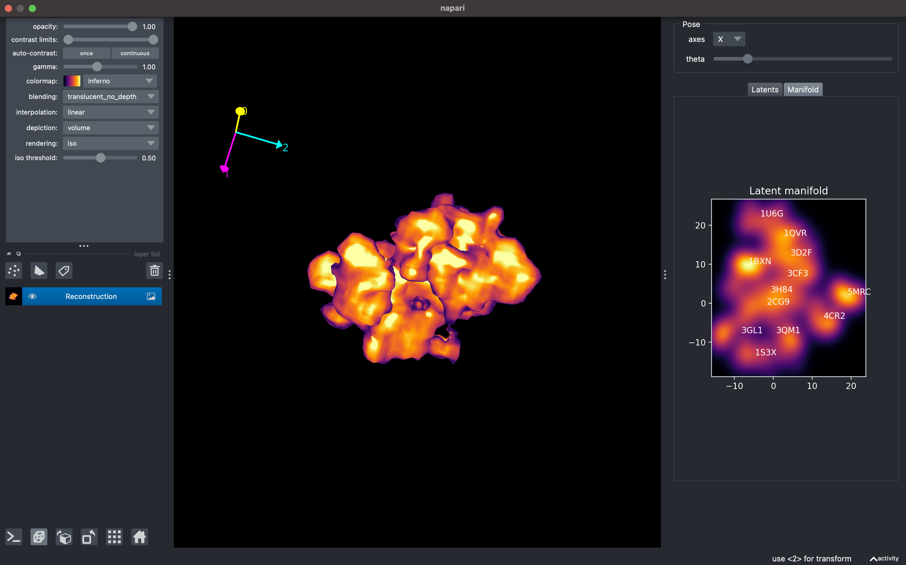
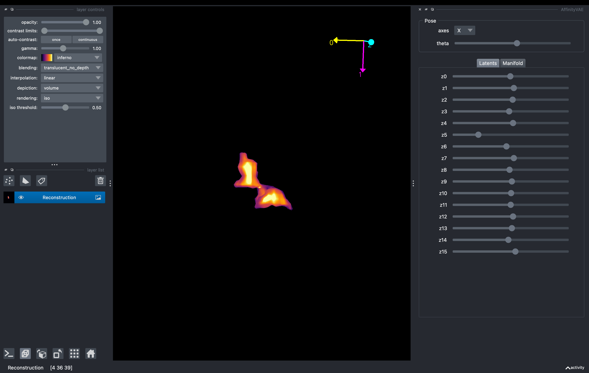

# Useful scripts for AffinityVAE

## Run Napari plugin on AffinityVAE trained models

We can inspect the latent space of the AffinityVAE models and the trained
decoder using a Napari pluggin. To do so, we need to install Napari and an older
version of pydantic (less than 2.0.0) to avoid conflicts with the napari
library.

For this you need to be at the root of the repository and run the following
commands:

```bash
python -m venv env_napari
source env_napari/bin/activate
python -m pip install --upgrade pip
python -m pip install -e ."[napari]"
```

> **Important note**: This environment should only be used for running the
> Napari plugin. If you want to run the AffinityVAE model, you'll need to
> install the requirements in a different python environment. The reason for
> this is that the napari library requires an older version of pydantic (1.10.0)
> and the AffinityVAE model requires pydantic > 2.0 or higher.

After setting up the environment, you can use the `--help` flag in the command
line to see the different options:

```bash

python scripts/run_napari_model_view.py --help

Output:

usage: run_napari_model_view.py [-h] --model_file MODEL_FILE --meta_file META_FILE [--manifold MANIFOLD] [--pose_dims POSE_DIMS] [--latent_dims LATENT_DIMS]

options:
  -h, --help            show this help message and exit
  --model_file MODEL_FILE
                        Path to model state file.
  --meta_file META_FILE
                        Path to the meta file.
  --manifold MANIFOLD   Manifold to use for latent space. This can be either `umap` or `load`.
  --pose_dims POSE_DIMS
                        Number of pose dimensions. This will overwrite the internal model value.
  --latent_dims LATENT_DIMS
                        Number of latent dimensions. This will overwrite the internal model value.
```

For a minimal usage you can run the Napari plugin just providing the model state
and meta files from a run:

```bash
python scripts/run_napari_model_view.py --model_file <path_to_model> --meta_file <path_to_meta>
```

in this case the pose and latent dimensions will be read from the model file and
the manifold will be created using the `umap` library.

**Using "umap" and "load" manifold options**:

Using the `umap` option can be slow, as the manifold is created on the fly and
reversed everytime you click on a point on the embedding map. If you want to use
the precomputed manifold from the AffinityVAE run, you can use the `load` option
(adding the flag `--manifold "load"` to the command line. This will use the
embedding variables from the meta file to create the manifold and it will
reverse to the latent space by finding the closest distance point in the data.
This is much faster than using the `umap` option and a good option for quick
debugging/exploring. However this option will not allow you explore unseen
regions of the latent space, only the available data.

**Example of usage**

Here you can see an example of the interface for the Napari plugin running on a
model trained on Shrec protein dataset. You can interact with the interface by
clicking on the different points on the embedding map and see the corresponding
reconstruction and latent space values. You can also scroll through the
different poses and the different latent dimensions and looking at the resulting
reconstructions using the available sliders on the top of the interface.
 
